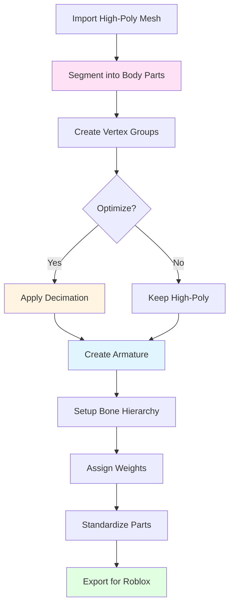

# Blender Pet Model Optimizer Plugin Foundation

## Overview

A Blender addon that provides professional mesh optimization, segmentation, and rigging tools for organic animal models. Adapts the proven workflow from the Roblox Studio plugin to Blender's native mesh editing, vertex groups, and armature systems.

## Core Objectives

1. **Mesh Optimization**: Reduce polygon counts while preserving organic shapes
2. **Body Part Segmentation**: Automatically segment and label body parts (head, body, legs, tail, wings)
3. **Rigging Preparation**: Create armatures with bones positioned for animation
4. **Part Standardization**: Normalize scales, orientations, and attachment points
5. **Export Compatibility**: Prepare models for Roblox import with proper naming and structure

## Architecture: Blender vs Roblox

| Feature | Roblox Studio | Blender Equivalent |

|---------|---------------|-------------------|

| **Mesh Access** | EditableMesh API | `bpy.data.meshes`, `bmesh` |

| **Part Segmentation** | Separate MeshParts | Vertex groups + bone weights |

| **Rigging** | Motor6D + Attachments | Armature + Bones |

| **Optimization** | Custom algorithms in Lua | bmesh operators + decimate modifier |

| **Part Labeling** | MeshPart.Name | Object names + vertex group names |

| **Attachment Points** | Attachment objects | Empty objects at bone locations |

| **Timeslicing** | `task.wait()` for stability | Blender's built-in threading (optional) |

## Plugin Structure

```
blender_pet_optimizer/
├── __init__.py                 # Addon registration
├── bl_info.json                # Addon metadata
├── operators/
│   ├── __init__.py
│   ├── mesh_optimizer.py      # Decimation operators (QEM, centroid)
│   ├── segmentation.py        # Body part segmentation
│   ├── rigging.py             # Armature creation & setup
│   ├── standardization.py     # Part normalization
│   └── export.py              # Roblox export preparation
├── ui/
│   ├── __init__.py
│   ├── panels.py              # UI panels for N-panel
│   └── preferences.py         # Addon preferences
├── utils/
│   ├── __init__.py
│   ├── algorithms.py          # QEM, centroid clustering
│   ├── segmentation_templates.py  # Pet type templates
│   └── bmesh_helpers.py       # bmesh utilities
├── config/
│   ├── templates.py           # Segmentation templates
│   └── standards.py           # Standard attachment points
└── data/
    └── body_part_labels.json  # Part naming conventions
```

## Implementation Strategy

### Phase 1: Plugin Foundation & Mesh Optimization

**Goal**: Basic addon structure with mesh decimation capabilities

**Files**:

- `__init__.py` - Addon registration
- `bl_info.json` - Metadata (name, version, description)
- `operators/mesh_optimizer.py` - Decimation operators
- `utils/algorithms.py` - QEM and centroid clustering algorithms

**Features**:

1. **Centroid Clustering Decimation**

   - Use Blender's `bmesh` for efficient mesh editing
   - 4-pass algorithm adapted from Roblox version:
     - Pass 1: Vertex clustering (spatial hashing)
     - Pass 2: Calculate centroids
     - Pass 3: Remap faces to centroid vertices
     - Pass 4: Remove degenerate faces
   - Progress reporting via Blender's `bpy.app.timers`

2. **QEM Edge Collapse**

   - Implement quadric error metric in Python
   - Use `bmesh` for edge collapse operations
   - Boundary preservation via edge flagging
   - Algorithm selection based on face count

3. **UI Panel**: Mesh Optimization

   - Object selection dropdown
   - Algorithm selection (auto/qem/centroid)
   - Target reduction slider (10-90%)
   - Grid size control for centroid clustering
   - "Optimize Mesh" button

### Phase 2: Body Part Segmentation

**Goal**: Automatically segment meshes into labeled body parts

**Files**:

- `operators/segmentation.py` - Segmentation operators
- `utils/segmentation_templates.py` - Pet type templates
- `config/templates.py` - Quadruped, biped, flying templates

**Features**:

1. **Spatial Segmentation**

   - Analyze mesh bounding box
   - Use region-based detection (Y-axis height for head/body)
   - Identify protrusions (legs, wings, tail) via mesh connectivity
   - Create vertex groups for each body part

2. **Part Labeling**

   - Vertex groups: "Head", "Body", "Leg_L", "Leg_R", "Tail", etc.
   - Object naming: `{AnimalType}_{PartName}` (e.g., "Cat_Head")
   - Material assignment for visual separation
   - Optional: Color-coded materials per part

3. **Segmentation Templates**
   ```python
   TEMPLATES = {
       "quadruped": {
           "head": {"y_min": 0.7, "y_max": 1.0},
           "body": {"y_min": 0.3, "y_max": 0.7},
           "leg_front_l": {"x_min": 0.0, "x_max": 0.5, "z_min": 0.5},
           # ... etc
       },
       "biped": {...},
       "flying": {...}
   }
   ```

4. **UI Panel**: Segmentation

   - Pet type selector (quadruped/biped/flying)
   - Auto-detect button
   - Preview mode (shows vertex groups in Edit mode)
   - "Segment Model" button
   - Manual adjustment tools (paint vertex groups)

### Phase 3: Rigging Preparation

**Goal**: Create armatures with bones positioned for animation

**Files**:

- `operators/rigging.py` - Armature creation operators
- `config/standards.py` - Standard bone positions and naming

**Features**:

1. **Armature Creation**

   - Create armature object from mesh
   - Generate bones based on segmentation vertex groups
   - Position bones at part centroids
   - Set up bone hierarchy (root → body → parts)

2. **Bone Naming Convention**

   - Root bone: "Root"
   - Body parts: "Head", "Body", "Leg_L_01", "Leg_R_01", "Tail_01"
   - Maintain consistency with Roblox attachment naming

3. **Bone Positioning**

   - Calculate bone location from vertex group centers
   - Set bone orientation (forward = +Y, up = +Z)
   - Define bone lengths from part bounds
   - Parent-child relationships based on part connections

4. **Weight Painting Setup**

   - Auto-assign vertex weights from segmentation groups
   - Smooth weights at boundaries for clean deformation
   - Optional: Manual weight painting tools

5. **UI Panel**: Rigging

   - "Create Armature" button
   - Bone naming prefix option
   - Auto-weight painting toggle
   - "Setup Rig" button

### Phase 4: Part Standardization

**Goal**: Normalize parts for compatibility in breeding system

**Files**:

- `operators/standardization.py` - Normalization operators
- `config/standards.py` - Standard scales, orientations, attachment points

**Features**:

1. **Scale Normalization**

   - Reference: Body part = 1.0 scale
   - Calculate relative scales for all parts
   - Apply normalization to selected parts
   - Preserve mesh quality (no geometry distortion)

2. **Orientation Standardization**

   - Standard forward: +Y axis
   - Standard up: +Z axis
   - Apply rotations to match standard
   - Update bone orientations to match

3. **Attachment Point Markers**

   - Create Empty objects at standard attachment locations
   - Naming: "NeckAttachment", "HipAttachment", etc.
   - Position relative to part bounds
   - Export metadata for Roblox import

4. **Part Metadata**

   - Store part type, scale factor, orientation in custom properties
   - Export to JSON for Roblox workflow integration
   - Compatibility checking between parts

### Phase 5: Export Preparation

**Goal**: Prepare models for Roblox import

**Files**:

- `operators/export.py` - Export operators
- `utils/roblox_export.py` - Roblox-specific export helpers

**Features**:

1. **Model Structure Validation**

   - Check naming conventions
   - Verify armature setup
   - Validate attachment points
   - Ensure mesh topology is valid

2. **Export Formats**

   - FBX with proper scaling (Roblox-compatible)
   - OBJ for parts library
   - JSON metadata for part compatibility

3. **Part Library Export**

   - Export individual parts as separate files
   - Maintain standardized naming
   - Include attachment point metadata
   - Create library directory structure

## Key Algorithms (Adapted from Roblox)

### Centroid Clustering (Blender bmesh)

```python
import bmesh
from mathutils import Vector

def centroid_cluster_decimate(mesh, grid_size, target_reduction):
    """4-pass centroid clustering using bmesh"""
    bm = bmesh.new()
    bm.from_mesh(mesh)
    bm.faces.ensure_lookup_table()
    bm.verts.ensure_lookup_table()
    
    # Pass 1: Cluster vertices by grid cell
    grid_buckets = {}
    vert_to_grid = {}
    
    for vert in bm.verts:
        pos = vert.co
        grid_key = (int(pos.x / grid_size), 
                   int(pos.y / grid_size), 
                   int(pos.z / grid_size))
        
        if grid_key not in grid_buckets:
            grid_buckets[grid_key] = []
        grid_buckets[grid_key].append(vert)
        vert_to_grid[vert] = grid_key
    
    # Pass 2: Calculate centroids
    grid_centroids = {}
    for grid_key, verts in grid_buckets.items():
        centroid = Vector((0, 0, 0))
        for vert in verts:
            centroid += vert.co
        centroid /= len(verts)
        grid_centroids[grid_key] = centroid
    
    # Pass 3: Move vertices to centroids
    for vert in bm.verts:
        grid_key = vert_to_grid[vert]
        vert.co = grid_centroids[grid_key]
    
    # Pass 4: Remove duplicate vertices and degenerate faces
    bmesh.ops.remove_doubles(bm, verts=bm.verts[:], dist=0.001)
    bmesh.ops.dissolve_degenerate(bm, edges=bm.edges[:], dist=0.001)
    
    bm.to_mesh(mesh)
    bm.free()
```

### Body Part Segmentation

```python
def segment_by_regions(obj, template):
    """Segment mesh into body parts using spatial regions"""
    mesh = obj.data
    bbox = [obj.matrix_world @ Vector(corner) 
            for corner in obj.bound_box]
    min_bbox = Vector((min(v.x for v in bbox), 
                      min(v.y for v in bbox),
                      min(v.z for v in bbox)))
    max_bbox = Vector((max(v.x for v in bbox),
                      max(v.y for v in bbox),
                      max(v.z for v in bbox)))
    size = max_bbox - min_bbox
    
    # Create vertex groups
    for part_name, region in template.items():
        vg = obj.vertex_groups.new(name=part_name)
        
        # Select vertices in region
        indices = []
        for vert in mesh.vertices:
            world_pos = obj.matrix_world @ vert.co
            relative = (world_pos - min_bbox) / size
            
            if (region.get("y_min", 0) <= relative.y <= region.get("y_max", 1) and
                region.get("x_min", 0) <= relative.x <= region.get("x_max", 1) and
                region.get("z_min", 0) <= relative.z <= region.get("z_max", 1)):
                indices.append(vert.index)
        
        vg.add(indices, 1.0, 'REPLACE')
```

## UI Layout (Blender N-Panel)

```
┌─ Pet Model Optimizer ─────────────┐
│                                    │
│ ┌─ Mesh Optimization ───────────┐ │
│ │ Object: [Dropdown]            │ │
│ │ Algorithm: [Auto/QEM/Centroid]│ │
│ │ Reduction: [===0%===60%===]   │ │
│ │ Grid Size: [0.3]              │ │
│ │ [Optimize Mesh]               │ │
│ └────────────────────────────────┘ │
│                                    │
│ ┌─ Segmentation ─────────────────┐ │
│ │ Pet Type: [Quadruped ▼]       │ │
│ │ [Auto-Detect]                 │ │
│ │ Preview: [On/Off]             │ │
│ │ [Segment Model]               │ │
│ └────────────────────────────────┘ │
│                                    │
│ ┌─ Rigging ──────────────────────┐ │
│ │ Bone Prefix: [Pet_]            │ │
│ │ Auto-weights: [✓]              │ │
│ │ [Create Armature]              │ │
│ │ [Setup Rig]                    │ │
│ └────────────────────────────────┘ │
│                                    │
│ ┌─ Standardization ──────────────┐ │
│ │ Normalize Scale: [✓]           │ │
│ │ Standardize Orientation: [✓]   │ │
│ │ [Standardize Selected Parts]   │ │
│ └────────────────────────────────┘ │
│                                    │
│ ┌─ Export ───────────────────────┐ │
│ │ Format: [FBX ▼]                │ │
│ │ Include Metadata: [✓]          │ │
│ │ [Export Model]                 │ │
│ │ [Export Part Library]          │ │
│ └────────────────────────────────┘ │
└────────────────────────────────────┘
```

## Workflow Integration

### Complete Workflow (Segmentation → Optimization → Rigging)



**User Steps**:

1. Import high-poly animal mesh (e.g., 50K faces)
2. Select mesh → Click "Segment Model" (creates vertex groups)
3. Optionally: Select parts → Click "Optimize Mesh" (reduces faces)
4. Click "Create Armature" (generates bones from vertex groups)
5. Click "Setup Rig" (assigns weights, sets hierarchy)
6. Select parts → Click "Standardize Selected Parts"
7. Click "Export Model" or "Export Part Library"

## Key Differences: Blender vs Roblox

| Aspect | Roblox Studio | Blender |

|--------|---------------|---------|

| **Mesh Editing** | EditableMesh (limited) | bmesh (full control) |

| **Performance** | Timeslicing required | Native threading available |

| **Segmentation** | Separate objects | Vertex groups (non-destructive) |

| **Rigging** | Motor6D joints | Armature bones |

| **Export** | In-place modification | Export to file |

| **UI** | Plugin panel | N-panel addon |

## Advantages of Blender Implementation

1. **Better Mesh Tools**: bmesh provides more control than EditableMesh
2. **Non-Destructive**: Vertex groups allow undo/redo without losing segmentation
3. **Visual Feedback**: See segmentation in real-time in Edit mode
4. **Professional Rigging**: Full armature system vs simple Motor6D setup
5. **Batch Processing**: Can process multiple files automatically
6. **Industry Standard**: Export to FBX/OBJ for any engine, not just Roblox

## Success Criteria

- ✅ **Segmentation**: Automatically identifies 4-8 body parts with 90%+ accuracy
- ✅ **Optimization**: 50-80% reduction while preserving organic shapes
- ✅ **Rigging**: Generates armature with correct bone hierarchy
- ✅ **Compatibility**: Exported parts work in Roblox with minimal adjustment
- ✅ **Performance**: Processes 20K face meshes in <10 seconds
- ✅ **User Experience**: Clear UI, one-click operations, helpful tooltips

## Future Enhancements

- AI-assisted part detection (using Blender's geometry nodes)
- Automatic texture mapping preservation
- LOD generation (multiple reduction levels)
- Batch processing multiple models
- Integration with Blender's Asset Browser
- Custom export formats for other engines